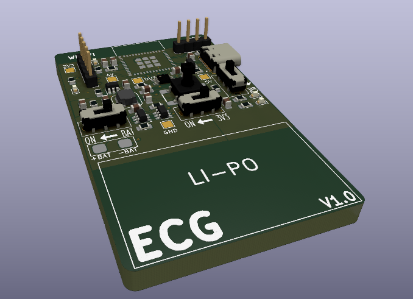
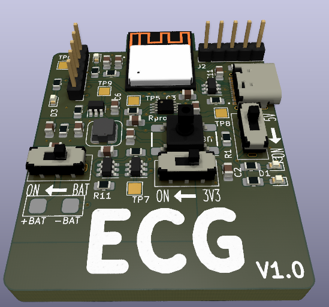
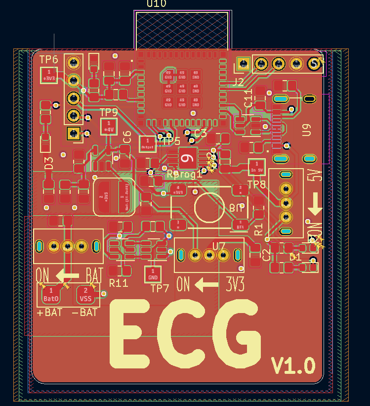
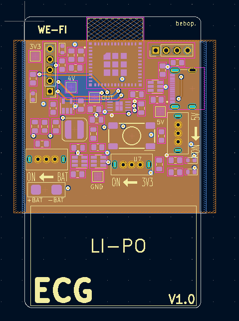
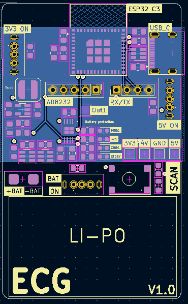
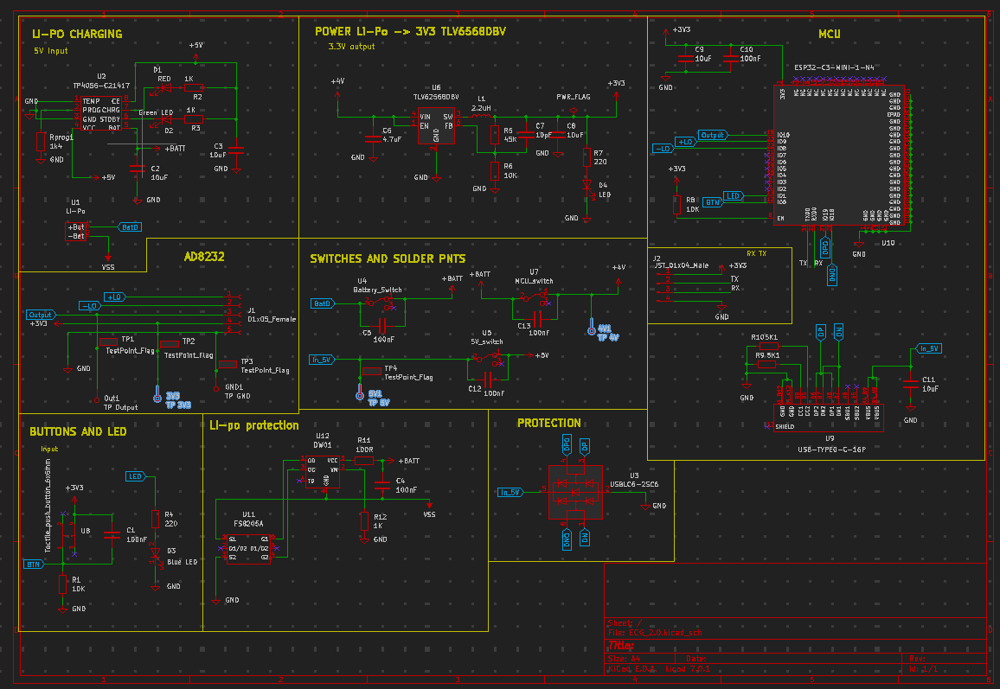

# Real-time Wearable-based Cardiac Monitoring with Machine Learning

## Design Problem
Heart disease describes a range of conditions that affect a person’s heart, including blood vessel disease, arrhythmias, valve disease, etc.Various tests are used to diagnose heart conditions. Doctors start with a risk assessment looking into medical history, blood pressure, as well as past and current symptoms but further tests may be required. These methods can be hard to access for most people, due to socio-economic factors. This is a long and outdated process in the digital era of telemedicine. Doctors and patients need fast, easily accessible procedures. 

Many forms of it can be prevented with healthy lifestyle choices and medical interventions. Stress can affect the body mentally and physically left unchecked manifests as an increased heart rate among other symptoms contributing to high blood pressure, diabetes, and heart disease.

Computational advancements have increased the ability to predict and prevent abnormalities by creating faster, less intrusive, and more easily accessible methods. The solution is a blend of software and hardware where an electrocardiogram (ECG) sensor that transmits a user’s heartbeat to a machine-learning algorithm in real-time to provide actionable feedback on potential abnormalities. 

## Components
---------------
This is an ECG reader capable of recording data and transmistting the data via bluetooth to a computer or cellphone for analyzing using 3 leads. 

The PCB uses a ESP32-C3-MINI-1-N4, a Li-Po with a battery charging module and a buck conmverter to supply 3.3V to the rest of the components. 

The main ECG components are an AD8232 opAmp board utilized for reading the electrical signals of the wearers heart and jack port for the 3 leads. 

## PCB
This is a 4 layer PCB board that uses a AD8232 breakout board for the ECG pickup. 
The schematic, featuring over charge and discharge protection, switches to control: MCU power, 5V (charging) and Battery power. Also includes ESD protection for usb type C. The brains is an ESP32-C3-MINI-1-N4.

#PCB layout 

#The schematic

##Findings, Changes

I did not not the ESP32 module I chose was a "standard" component for JLCPCB which means it costed much more to manufacture this board then originall anticipated. 
Going forward I would choose a chip that does not require "standard" assembly 

With more time I would like to integrate the AD8232 onto the board and overall make the board more compact with a very small lipo battery. 

t been tested but I will be following up on the findings for that as well. 

My first initial thoughts is I may have needed to include a pulldown resistor for the output of the AD8232. 

Overall I would like to make it cleaner, more LEDs for feedback etc. 