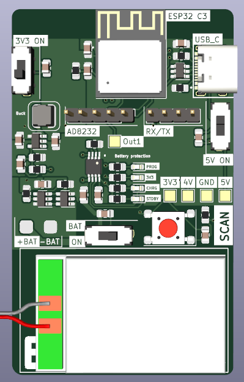
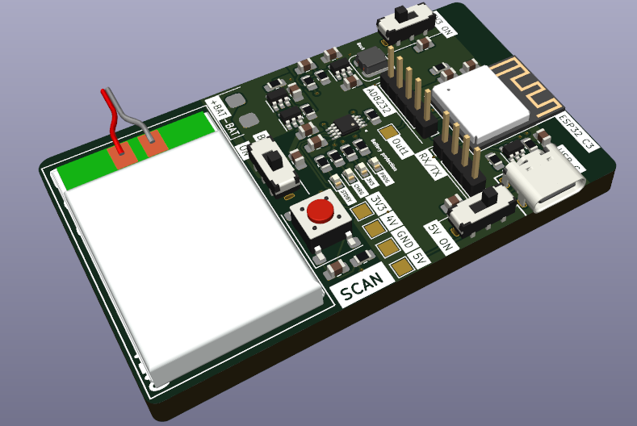
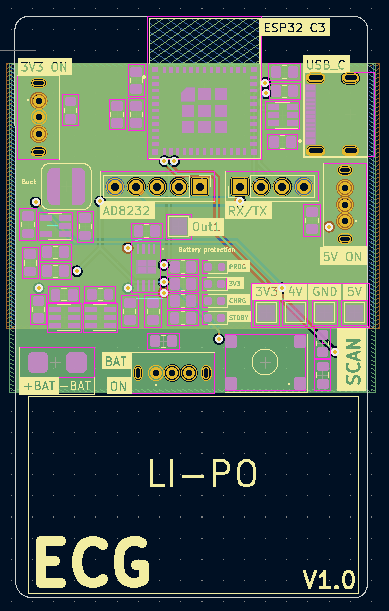
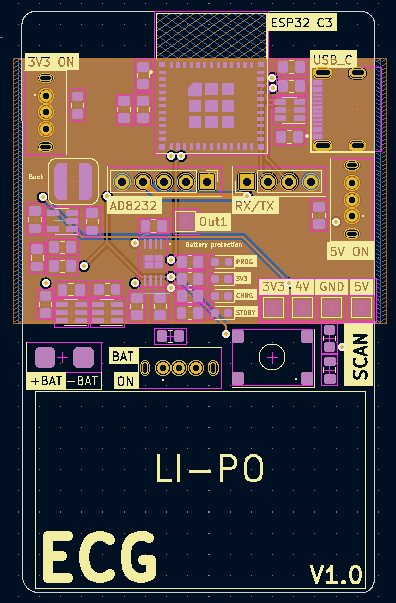

# Real-time Wearable-based Cardiac Monitoring with Machine Learning
This project was part of ELEC490/498: Electrical Computer Engineering Capstone Project. A 3 semester long undertaking at Queen's Univeristy, Ontario, Canada. 

## Design Problem
Heart disease describes a range of conditions that affect a person’s heart, including blood vessel disease, arrhythmias, valve disease, etc.Various tests are used to diagnose heart conditions. Doctors start with a risk assessment looking into medical history, blood pressure, as well as past and current symptoms but further tests may be required. These methods can be hard to access for most people, due to socio-economic factors. This is a long and outdated process in the digital era of telemedicine. Doctors and patients need fast, easily accessible procedures. 

Many forms of it can be prevented with healthy lifestyle choices and medical interventions. Stress can affect the body mentally and physically left unchecked manifests as an increased heart rate among other symptoms contributing to high blood pressure, diabetes, and heart disease.

Computational advancements have increased the ability to concurrently predict and prevent cardiac abnormalities. Thus creating faster, less intrusive, and more easily accessible methods for patients and practitioners alike.

## Design and Implementaiton

Low-cost ECG (electrocardiogram) electrodes using a 3 lead configuraiton are used to capture impulses through the heart muscles and transmit the information via Bluetooth to a machine-learning algorithm in real-time to provide actionable feedback on potential abnormalities and stress levels via a Graphical User Interface, as seen in the following implementation pipeline.

---------------

### Hardware @17jwk3

The PCB uses a ESP32-C3-MINI-1-N4, a Li-Po with a battery charging module and a buck conmverter to supply 3.3V to the rest of the components. 
The main ECG components are an AD8232 opAmp board utilized for reading the electrical signals of the wearers heart and jack port for the 3 leads. 

#### PCB
This is a 4 layer PCB board that uses a AD8232 breakout board for the ECG pickup. 
The schematic, featuring over charge and discharge protection, switches to control: MCU power, 5V (charging) and Battery power. Also includes ESD protection for usb type C. The brains is an ESP32-C3-MINI-1-N4.

#### PCB layout 

#### Schematic

#### Findings & Changes

The selected ESP32 module was a "standard" component for JLCPCB which means it costed much more to manufacture this board then originally anticipated. A chip that does not require "standard" assembly would be selected going forward. 

With more time, the AD8232 module would be integrated onto the board to increase portability with a very small lipo battery. Additional changes would be made to optimize the layout, add more LEDs for feedback etc. 

The output of the AD8232 may have needed to include a pulldown resistor. 

---------------

### Data Acquisition @17jwk3
#### Design
Data is acquired using the AD8323 amplifier and processed by the ESP32 microcontroller. The amplifier is connected to a 3-lead system placed on the end-user’s person. The top L and R leads are used for data acquisition, while the third and lower lead is the grounding lead.  

The data is sampled at 6 seconds with a 115,200 baud rate. It uses a fixed 360 frequency in accordance with the arrhythmia dataset. Heart beats are characterized by shape and frequency. Abnormalities distinguished by pace (Sinus Arrhythmia, Bradycardia, etc.) would incur informational loss or distortion from domain resampling .

The firmware was coded using the Arduino IDE, a variant of the C++ programming language. It records when both L and R leads sense an electrical signal, as to avoid null readings from not being applied.

In order to create the dataset locally, run 'Models and Prediction/reciever.py'.

#### Findings & Changes

Modification in limb electrode placement invokes changes in ECG wave amplitudes, which may alter the clinical limits of ECG normality detection. It was uncovered that leads placed no further than 12” apart yield the cleanest readings. 

---------------

### Processing and Filtering @CTy27
#### Design
Processing was designed to address missing values and noise artifacts from the raw ECG data using the appropriate filtering methods.

The constraints surrounding hardware filters far outweighed those using software, as hardware filters are more expensive, more difficult to test, and would increase the PCB footprint. Software filtering allows for greater control and optimization which leads to a more optimally processed resulting signal.

A technique known as imputation was used to recover lost values by synthesizing datapoints that hardware failed to capture. Particularly, K-Nearest Neighbors (KNN) imputation is a method used to impute missing values by finding the K closest observations and using their respective values to ‘fill in’ the missing ones. In the application of ECG processing, this method of imputation is beneficial as it accounts for the temporal structure of the data, making KNN imputation a natural choice.

The chosen implementation uses a 3rd order, lowpass Butterworth filter with a cutoff frequency of 50 Hz. 50Hz was found to be the optimal amount as observable high-frequency artifacts from power line interference and EMG were removed without limiting the low-frequency salient information. Lowering this cut-off frequency further resulted in distortion to the amplitude of the peaks, which would have adversely affected the prediction model’s performance. 

#### Findings & Changes
Testing different filters and parameters was largely trial and error testing. Lowpass, high pass, bandpass, and notch filters were all tested, adjusting cut-off frequencies and passbands as appropriate. 

High pass and bandpass filters were susceptible to baseline wander, from samples 4,000 – 5,000 that the signal baseline drifts upwards. The high pass was also unable to filter out the high-frequency noise induced by Electromyography muscular activity (EMG), motion artifacts, and residual channel noise. The clear choice was lowpass as it maintains the salient, low-frequency information without distorting the signal with baseline wander. 

There lies uncertainty in the exclusive use of lowpass to filter out noise, as a bandpass and a notch filter ensemble are standard for ECG data.  Solely relying on low-pass filters is not a common approach, however, the final product was sufficient for the classification models to perform adequately. 

---------------

### Arrhythmia Detection @alexkoch14
#### Design
The arrhythmia model was trained on the MIT-BIH database, containing 48-half-hour excerpts of two-channel ambulatory ECG recordings, obtained from 47 subjects studied by the BIH arrhythmia laboratory between 1975 and 1979.

The recordings were digitized at 360 samples per second and two or more cardiologists independently annotated each record.

The recordings were extracted using wfdb, the Python wave-form database package. ECG signals are transformed into snippets during the data pre-processing step as the model analyzes one-dimensional input data. 

Heartbeats in the first or last 3 seconds of the half-hour recording are ignored to reduce data clipping sizes, as is for any non-beat annotations. Beat symbols are encoded as abnormal (1) or normal (0). 

A sliding window of 6 seconds per beat segment is used to capture the current beat and those adjacent to retain enough information from encompassed patterns ensuring a 2-3 beat overlap. 
The following graph demonstrates that encoded abnormal beats (those other than ‘N’, later encoded to 1) yield an even distribution, thus eliminating the need for resampling. 

Heartbeat voltages range among individuals depending on anatomy, body composition, blood volume, and ECG lead placement. Z-score normalization standardizes values into how much each reading deviates from the mean of all readings within the sample window.

In order to create the dataset locally, run 'Models and Prediction/arrhythmia_data.py'.

Leave-One-Out Crass-validation was employed via a hold-out set. The database was divided into three sets using a 60/30/10 train/validation/test split.
The holdout set primarily sought to encompass ~5 unseen subjects, consequentially representing ~10% of the data. 

The Deep-Learning (DL) model follows a Convolutional Neural Network architecture (CNN) using a TensorFlow backend.

arr_model_v4 uses a shallow, wide and simple architecture to overcome common real-time classification issues. 

The dataset has few features, but lots of records. This is perfect for DL models that need fewer parameters and sample complexity to achieve acceptable performance.

The model was trained on three passings of the training data (epochs). Accuracy decreased, loss increased, and overfitting began to occur beyond this point. 

In order to replicate the model, run 'Models and Prediction/arrhythmia_model.py'.

#### Findings & Changes
arr_model_v4’s performance indicates 87.7% accuracy and 84% recall on the test set, which comprises unseen patients, as seen in 'media/CNN_v4_results.txt'.

This is satisfactory for real-time classification uses which aren’t meant to serve as a clinical diagnosis. 

It showed minimal signs of overfitting with training loss and validation losses of 0.2195 and 0.2264 respectively. 

A limitation of the current methodology lies in grouping all abnormal patterns to obtain even distribution without resampling. It is possible that CNN v4’s ~90% accuracy is accredited is predicting 80% of abnormality types with 100% accuracy, and the remaining 20% with 0% accuracy. The model might not be able to predict less prevalent abnormality patterns while being excellent in predicting common ones.

---------------

### Stress Detection @alexkoch14
#### Design
The multimodal SWELL Knowledge Work dataset for stress modeling (SWELL-KW) contains data from 25 participants (~3 hours each) performing typical office work (writing reports, reading emails, etc.) under 3 conditions: no stress (0), email interruptions (1) and time pressure (2).

The stress model was trained on HRV metrics obtained from the SWELL-KW dataset.
Inter-beat interval (IBI) samples are extracted from the raw ECG signal of each subject over the 3-hour time series. 
HRV indices are then computed on a subset of the IBI signal array. New samples are appended to the IBI array while the oldest is removed from the beginning,creating a sliding window of HRV indices over a fixed acquisition window analogous to the arrhythmia data. 
This facilitates a granular study of how momentary heartbeat patterns and concurrent HRV metrics reflect a subject’s stress level. 

HRV metrics are computed from the input filtered signal using hrv-analysis Python library.

Leave-One-Out Crass-validation was employed via a hold-out set. The database was divided into three sets using a 60/30/10 train/validation/test split.
The holdout set primarily sought to encompass ~3 unseen subjects, consequentially representing ~10% of the data. 

Twenty-three classification models were then assessed using the LazyPredict Python library, indicating Guassian Naive Bayes provides the best time/accuracy trade-off.

In order to replicate the model, run 'Models and Prediction/stress_model.py'.

#### Findings & Changes

Stress model performance indicates a 57.1% F1-score on the validaiton set and 67.6% F1-Score on the test set, as seen in media/stress_model_v5_results.txt

The disparity in validation and testing sets accentuates some underlying points of issue. 

Models possess inherent predictive error which may lead to a relatively higher score on the test set due to chance.

The current neurobiological evidence suggests that HRV is impacted by stress and supports its use for an objective assessment of health, but it can be expressed through other psychological pathways (EDA, body posture, etc.).
These added features, which are not part of the feature set, are perhaps expressed more vividly in the validation subjects. 
Equivalently said, fewer people in the validation set tend to manifest stress predominantly through HRV than other physiological pathways. This is a limitation of training the stress model on a subset of a subset of the SWELL-KW dataset. 

Nonetheless, results are satisfactory for obtaining real-time assessments. Stress mitigation is a preventative step in cardiac abnormality evasion. It is the first line of defense, but an overpassed subject will get caught using CNN v4 used in arrhythmia detection.  

---------------

### Graphical User Interface @CTy27
#### Design
The GUI was designed to be responsive, have a low learning curve, and supply key metrics such as heart rate, abnormality likelihood, presence of stress, and supplement heart rate variability (HRV) metrics such as mean RR. These metrics were selected after conducting extensive research into clinical grade industry standard ECG monitors, to replicate their functionality.

The Python Tkinter library was selected to allow for seamless integration with the constituent sub-systems, as it can function using a single script requiring the end user to only use one file to access the functionality. Moreover, Tkinter is open sourced which ensures compatibility and facilitates future development. 

User testing was performed by gathering feedback from preliminary UI drafts. Users appreciated the color-coded feedback and unified design language, but feedback ultimately indicated that the lighter color scheme made the GUI appear less intimidating. 

The final design uses a clean modern interface with clear visualizations. It includes added features such as the ability to save and export data for further analysis via PDF using the “See Full Report” button. 

#### Findings & Changes
The GUI acts as a proof of concept and does not store any medical data; it loses all information once the front end is closed and thus is not bound to any regulatory compliance. The information displayed is not a formal diagnosis and the documentation serves as a clear indicator of whether a medical professional should be consulted. 

It performs similarly to commercial products, allowing for user initiation of ECG readings, and those readings being displayed visually once complete. 

The largest weakness lies in the usage of Python. The Tkinter library is very limiting from a design perspective, making it difficult to implement a modern-looking dashboard. 
It only supports certain shapes, images, and colors which makes the overall appearance less customizable. 
Another weakness lies in the Tkinter structure which required all other sub-systems’ code to be embedded into a single file due. Restarting the entire program is therefore necessary to initiate a new run. 
This is inconvenient to the end user as this operation is computationally expensive and can add time to the entire experience. Using another Python library like PyQt, or a mobile app software like Swift would likely increase the overall user experience and allow for multiple runs without restarting the entire front end, but further research would need to be conducted. 

---------------

## Replication 

Clone the repositiry to you local machine and run:
'ECG_Li\Models and Prediction\gui.py'
